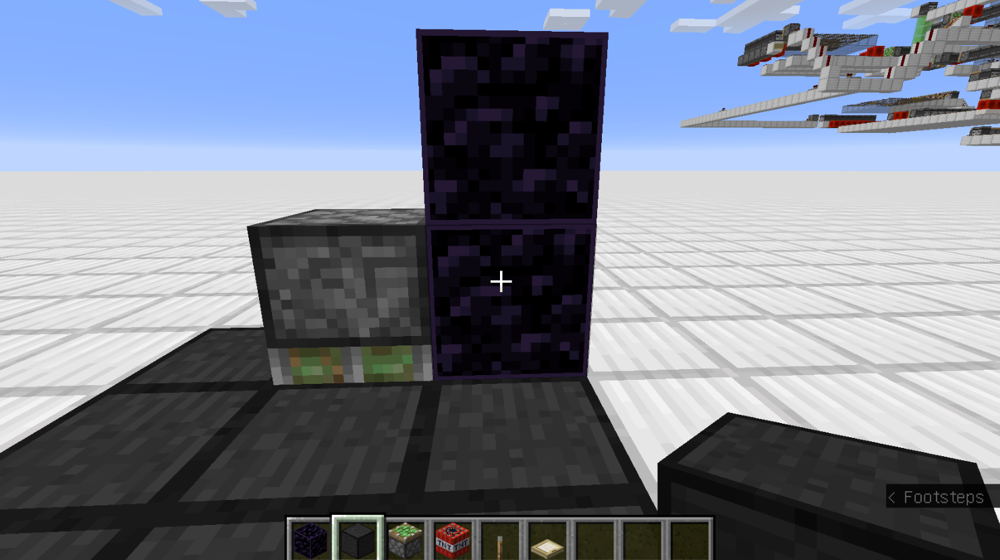

# 活塞性质初步
* * *
## 提示
本文所提到的活塞特性为Java版特有，且某些特性可能尚未得到验证。特性可能随版本变化；这些随版本变化特性将会在文中指出。且文章大部分为个人理解，如有错误，大可指出。

* * *
## 前置科技树
了解NC/PP更新，了解计划刻与更新顺序。
* * *
## 目录
* 活塞的组成
* 活塞的半连通性
* 活塞自检
* 活塞所移动的方块结构
* 活塞事件
* 活塞与漏洞利用

* * *

## 活塞的组成
活塞在收回时是一个方块，而活塞在伸出时包含两个部分：活塞头与活塞底座。接下来我们着重讨论静态的活塞性质。对于一个伸出的活塞，其底座可被看做其核心，有关静态活塞的大部分性质由底座决定。
> 活塞有伸出（extended=true）和收回（extended=false）两种状态。此参数是活塞底座而不是活塞头的属性。下图中紫色方框内的部分即为活塞底座，分别对应伸出与收回状态。


通常来说，一个活塞底座在被取消激活时会收回自己的活塞头，在激活时伸出自己的活塞头。单独处于伸出状态，却没有其活塞头的活塞底座并不常见。且当活塞底座处于extended=true状态时，并不会再去刻意检查自己是否拥有活塞头。倘若我们通过某些形式（本文中我们将会提到这种方法）去掉了一个激活活塞的活塞头，且在它的周围放置方块更新它，并不会使得它检测到自己“没有头”而重新“长”出活塞头。

> 下图展现了两个底座参数被设置为extended=true的活塞。但是其中一个却没有活塞头。只要不去除红石块，这种单独处于伸出状态的活塞底座结构就是稳定存在的。


接下来我们讨论一下活塞头的性质。与活塞底座不同的是，活塞头会检查自己是否会拥有一个对应的活塞底座。“对应的”是指，活塞头的后方存在一个和自己方向相同的活塞底座。

> “方向相同”这个要求是在1.16中新增的，在旧的版本中，只会进行“存在性”的检查，并不会进行“方向性”的检查。

> 下面这张图展示了一个活塞头和一个底座，但是他们不是“对应的”。活塞底座处于伸出的稳定状态，但是活塞头却不是稳定的，若破坏红色玻璃，活塞头就会进行一次自身的检查：在发现自己没有底座之后，它就会被破坏。


要注意的是，活塞头尽管会检测是否存在活塞底座，但是它不会去检测活塞底座的extended属性。

> 下图展示了一个稳定的结构。活塞底座处于extend=false的状态。如有更新涉及到活塞头，它会检测到自己已经有了一个对应的活塞底座，所以活塞头不会被破坏。如果有更新涉及到活塞底座，什么事情也不会发生。


## 活塞的半连通性（Quasi-connectivity）

半连接性（Quasi-connectivity）是发射器，投掷器和活塞的特性。对于一般的红石原件（例如，红石灯）来说，若它的一阶毗邻内存在红石信号，它才能被激活。但对于上述3个红石原件来说，它们还会额外检查自己上方一个方块的一阶毗邻的位置。

> 下图展现了一个红石灯，红色玻璃代表它的一阶毗邻，若在这6个区域内存在红石信号，红石灯将会亮起。


但是对于活塞来说，它将会额外检查5个区域，倘若这些区域存在红石信号，那么它也应当伸出。

> 一个活塞除了检查6个位置外（图中红色玻璃），还会额外检查5个位置（图中的灰色玻璃）。


要注意的是，由于灰色玻璃处在能更新到活塞的区域之外，在灰色玻璃区域放置的红石信号可能无法激活到活塞。

> 下图展现的一个活塞上方两个方块的位置存在一个红石块，此时活塞理应伸出，但是，由于放置此红石块之时并未更新到活塞，活塞“并不知道”自己应该伸出。此时，若给予NC更新（例如，在活塞边上放置方块），那么活塞就会主动伸出。关于NC/PP更新，请参阅本系列的其他章节。


利用活塞的这个特性，我们可以分割活塞的激活与更新部分。当一个活塞应当伸出/收回却没有伸出/收回时，给予一个更新即可将活塞恢复到正常状态。这种半连通（QC）特性使得活塞能够响应更新。

## 活塞自检

活塞会在特定条件下检查自身的状态（extended=true/false）。这些条件是：

* 1.当被玩家放置后
* 2.当受到NC更新后
* 3.当被其他活塞推动后

以上自检可能在游戏的不同阶段发生。例如，玩家放置的活塞将会在游戏主循环的玩家运算阶段执行。被其他活塞推动的活塞将会在方块事件（Block Event）运算阶段执行。

> 下图展现了两个活塞。拉下拉杆后，左边的活塞将被右边活塞推动至红石块正下方，左边的活塞到位后即刻自检（即条件3），当检测到有能够激活它的红石信号后，左侧活塞随即推出。


如果活塞检测到自己被激活了但是没有伸出，那么活塞就会尝试伸出。在尝试伸出前，活塞会进行能否伸出的检查。如果发现自己能够伸出，那么就会将伸出事件（id=0）放入方块事件中。如果不能伸出，则停止分析。
如果活塞检测到自己未被激活但是伸出了，那么活塞就会尝试收回。一般情况下，活塞会添加一个普通的收回事件（id=1）到方块事件中。但如果活塞发现前方的方块是自己还未推到位的方块，即活塞在为推方块到位的时候收到了收回信号，那么活塞将会把瞬推收回事件（id=2）加入到方块事件中。

#### 如何理解方块事件？什么是伸出事件、收回事件、瞬推收回事件？

 简单地说，Minecraft服务端运行着一个大的for循环。经过一次循环游戏就经过了1 tick。在这1 tick中，服务端需要处理很多的事件。Minecraft的做法是按照事件的不同属性进行分类，然后集中处理。例如，所有与玩家有关的行为被下方代码中的exec_player_actions()函数来处理。
> 伪代码中的函数名称只是便于理解其含义，并不代表其真实的名称和参数呈递结构。
```

Minecraft主循环伪代码（已阉割）:
for(;;){
    ...
    update_world_border();      //更新边界
    update_weather();           //更新天气
    update_tick();              //更新tick
    update_chunk();             //区块运算
    exec_tick_pending();        //执行计划刻
    exec_block_event();         //执行方块事件
    ...
    exec_player_actions();      //运算玩家的事件
    ...
}
```

例如，当玩家放置了一个活塞之后，活塞自检会发生在exec_player_actions()阶段，假设活塞判断自己应当伸出且能够伸出，那么游戏将会添加一个id=0的方块事件（Block Event，Minecraft类）到某个列表中，之后的下一tick当游戏运算到exec_block_event()时，会集中逐一按顺序处理这个列表里的所有方块事件。

对于伸出、收回、瞬推收事件来说，它们只是活塞事件的不同属性，其具体的特性将在下文分析。

## 活塞所移动的方块结构

活塞在行动前会建立维护两个列表：活塞将会推动的方块的集合PushList以及活塞将会破坏的方块的集合DestroyList。值得注意的是，PushList的大小不能超过12，也就是说，活塞将无法推动超过12个方块的结构。
具体构建这个PushList的算法本文将不做分析。但是，有一个大致适用的准则是，离活塞越近、分支越少的方块越先被添加进List中，并且，活塞会根据PushList列表逆序移动这些方块。换言之，离活塞越远、分支越多的方块越先移动。

## 活塞事件

当活塞把事件加入到方块事件后，游戏将会在exec_block_event()阶段对这些事件进行执行。并且，活塞会在这个阶段再一次检查自身的状态。

* 如果活塞是激活状态，但是先前添加的方块事件是收回事件（id=1），那么游戏将会结束这个事件
* 如果活塞尚未激活，但是先前添加的方块事件为伸出事件（id=0），那么游戏也会结束这个事件

> 例如，如果红石信号激活了一个活塞，触发加入方块事件，但在运算方块事件之前使得红石信号消失，那么活塞将不会改变其状态。

#### 伸出事件

活塞先对将要移动和破坏的方块建立一个列表，即PushList和DestoryList。
随后，摧毁处在DestoryList中的方块。对于大部分被摧毁的方块来说，并不发出NC/PP更新。对于某些特例，已经在附录里列出。
之后，活塞对每个在PushList中的方块逆序创建他们所对应的b36，b36生成在方块将要移动方向的前一格。活塞臂是最后创建的b36。每创建一个b36，游戏都会发出一次PP更新。
创建完成b36之后，某些方块可能已经被b36覆盖，某些方块却可能还是留在原地，游戏将会在之后删除它们（1.13+适用）。
之后，游戏将删除这些剩余方块，每删除一次产生一次PP更新（1.15之前适用）。对于1.15+，游戏将会先将这些方块全设置为空气，随后再发出PP更新。这一步删除/更新的顺序是位置相关的。
最后，发出NC更新，顺序是：
被摧毁方块+被移动方块+活塞头。
活塞将底座设置为extended=true，发出声音。

随后，b36开始计时3gt，计时完成之后变成普通方块。


#### 收回事件

如果活塞面前的位置是36号方块，那么活塞将会令跳过方块实体运算阶段而其强制到位，并且不检测相应b36的朝向。这点对于粘性活塞和普通活塞均成立。

对于粘性活塞，还有一个额外的性质。若它检测到活塞头的前一格是先前还未推动到位的方块，那么游戏将会令其强制到位。且它将不会尝试再拉回这个方块。这就是粘性活塞丢方块的特性。对于普通活塞，则不会做这样的检测。

> 在下图中，如果我们拉动拉杆，侦测器将会释放一个2gt脉冲，而粘性活塞需要3gt才能将方块推送到位，在2gt后侦测器信号消失，粘性活塞打算收回。但在收回时检测到前方是先前还未推动到位的方块，于是游戏就会令这个红石块强制到位，并且活塞收回，丢失方块。在这里，如果我们把粘性活塞换成普通活塞，则并相应无效果。


活塞在收回时，会将底座设置成36号方块，之后发出方块更新。
对于粘性活塞，在收回时可能会拉回其他方块。在尝试拉回之前，粘性活塞会进行一次判定：

* 本事件不能是瞬推收事件（即跳过此过程，造成粘性活塞短脉冲丢方块）
* 伸出方向的前一个格子不能是空气
* 该方块能被拉动
* 该方块能被正常推动或为普通/粘性活塞

如果判定生效，粘性活塞将会进一步地对整个可拉回的区域进行分析，如果发现不可拉动，则放弃拉动。

而对于普通活塞和拉回判定失败的粘性活塞，游戏则会把活塞头的位置设置成空气。播放拉回动画，完成收回。

> 在下图中，自上而下分别是：将要拉回的普通活塞，将要拉回且判定成功粘性活塞，将要拉回且判定失败的粘性活塞。可以预见的是，当拉下拉杆后，中间的活塞将不会破坏黑曜石，因为活塞对整个可拉动的区域进行分析后，发现拉动包含自身，从而放弃拉动。而上边与下边的活塞将会破坏黑曜石，因为它们把前方一格的位置设置成了空气。


> 这种利用粘性活塞收回失败/普通活塞直接收回的方式，能破除一切常见方块。例如基岩、命令方块等。


#### 瞬间到位

瞬间到位有2种情况，我们逐一分析。
* 第一种情况：收回事件，且活塞头的位置是b36

由于这种情况并不限制b36的朝向，我们可以建造如下装置，当我们拉下拉杆后，红色的玻璃将瞬间到位。

>在下图中，分别有一个无头的、底座是extended=true的粘性活塞与未伸出的普通活塞。在我们拉下拉杆后，经过4gt，信号同时到达比较器与中继器。普通活塞要伸出，粘性活塞要收回。由于比较器有更高的优先级，所以在同一个游戏刻里，是先运算普通活塞的伸出事件，再运算粘性活塞的收回事件。对于普通活塞的伸出事件，它在粘性活塞前放的位置构建了红色玻璃对应的b36；而到了粘性活塞的收回事件时，游戏检测到其前方是b36（不检测朝向），就令其强制到位。之后再执行收回。

> 之后执行收回时，检测到前方有黄色玻璃，所以满足尝试拉回的四条判据之一，粘性活塞尝试拉回。但是由于拉回的结构中包括自身，拉回失败。要注意，如果把无头粘性活塞换成无头普通活塞，那么这个红色玻璃将会被删除。


* 第二种情况：粘性活塞，收回事件，同方向推出的b36
  
我们来分析一下下图红色玻璃能被瞬推的原因。

>下面这个装置由左侧的普通活塞和右侧伸出状态的粘性活塞（BUDed）组成。拉下拉杆后，普通活塞计划了一个伸出事件，在红色玻璃前方构建了对应的b36，而在完成构建后，才发出NC更新。发出的更新让粘性活塞在同一tick添加了收回事件。粘性活塞检测到前方有一个同方向推出的b36，于是令其瞬间到位。


> 下图展现了拉下拉杆之后的瞬间，未移动的盔甲架证明了这是瞬间到位的方块。


## 活塞与漏洞利用

* Fallen_Breath的破基岩机器


>玩家拉下拉杆，TNT将在80gt之后爆炸。TNT的爆炸属于实体运算阶段，处在同一tick的方块事件处理之后。左侧TNT爆炸后将摧毁拉杆，同时更新到活塞，于是活塞加入一个收回事件到下一个tick中。随即右侧TNT爆炸，摧毁了活塞。


>之后游戏对玩家行为进行运算，而玩家在下图中放置了一个朝下的活塞。



>最后，本tick结束，进入下一tick的方块事件运算阶段。游戏获取收回事件处的活塞种类以及朝向，发现活塞本身仍旧存在，所以执行收回事件。利用粘性活塞的收回失败或者是普通活塞的直接拉回，将基岩所在的位置设置为空气，完成基岩的破除。

这个漏洞利用了游戏在方块运算阶段执行活塞事件时不检查活塞的朝向，只检查活塞的种类的行为。如果活塞种类不同，例如，玩家放置的活塞是粘性的，而之前推出TNT的活塞是普通的，那么这个收回事件就不会被执行。游戏只检查活塞种类是否匹配，而不检查方向。事件中方向参数pos的传递只用于执行而非判定其有效性。总的流程图如下：


利用这种想法，我们能轻松做出各种各样的破除基岩的机器，以满足不同生产条件的需要。追求机器的简单话甚至是自动化，也成了我们将着重讨论的课题。

* 另一个破基岩的机器

>原理类似，途中包含的1个BUDed的粘性活塞、2个伸出的无头粘性活塞、 1个朝下的粘性活塞（面对基岩）以及一个伸出的、连接着史莱姆块的活塞。当拉下拉杆，首先左边的无头活塞拉回，破坏到BUDed的粘性活塞，同时添加了一个收回事件；其次，连接着黏液块的活塞准备收回，创建b36；最后，第二个无头活塞检测到前方是b36，使得朝下的活塞瞬间到位，面对基岩。最后的最后，在Block Event执行收回，完成基岩的破除。以上一切的更新顺序由中继器和比较器来保证。其中白色玻璃是为了让粘性活塞收回失败。


